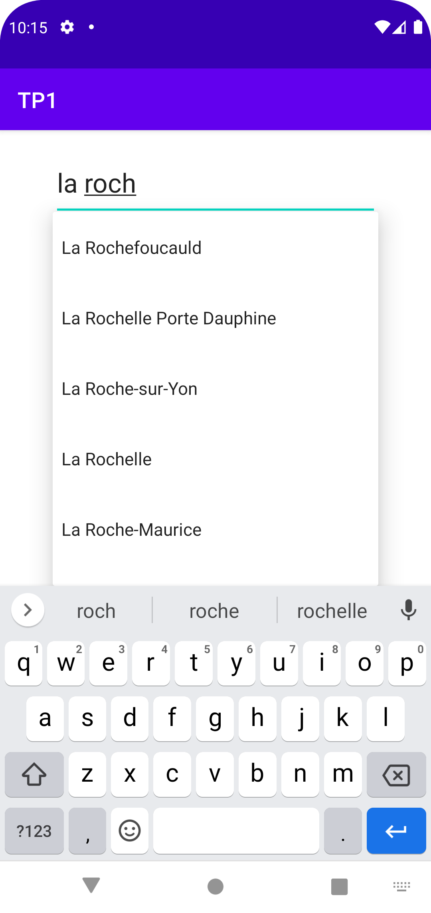
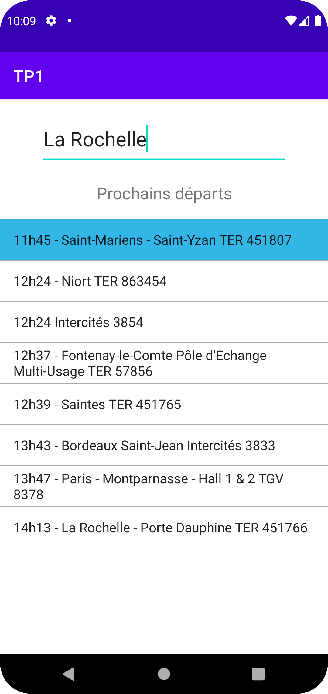

# Application Android-Kotlin SNCF API

Cette application Kotlin a été réalise pour un TP d'introduction à Kotlin. Elle se base sur l'api de la SNCF, ainsi que sur la lecture d'un fichier csv.
Dans un premier temps nous devions récupérer et afficher ses informations sur le train : 

- heure de départ
- la destination
- le type du train
- le numéro du train

Dans un second temps nous devions récupérer les informations sur ses différents arrêts avec comme informations sur les arrets en respectant un diagramme de classes : 
- heure de départ
- minute de départ
- heure de l'arrivée
- minute de l'arrivée
- identifiant de l'arrêt
- nom de l'arret
- coordonnées gps de l'arrêt

J'ai rajouté par rapport à ce qui était demandé dans le TP :

- La possibilité d'afficher les arrêts depuis la gare de départ du train et non la gare sélectionnée.

- La gestion des trajets en autocar, bus.

# Fonctionnement global de l'application en 4 étapes :

- Pour générer le menu déroulant avec la liste des trains nous utilisons le fichier csv.

- Puis nous faisons une requête à l'[API SNCF](https://api.sncf.com/v1/coverage/sncf/stop_areas/stop_area:SNCF:87485003/departures "API SNCF") en modifiant l'identifiant en fonction de la gare sélectionnée afin de récupérer les trains partant de cette gare.

- Ensuite nous récupérons les informations du trajet des trains avec cette requête à l'[API SNCF](https://api.sncf.com/v1/coverage/sncf/vehicle_journeys/vehicle_journey:SNCF:2023-02-09:864779:1187:Train "API SNCF") en modifiant l'identifiant du véhicule journey en fonction du train. L'identifiant est récupéré via la première requête.

- Pour finir lors d'un click sur un train, on ouvre une map google à laquelle on rajoute des marqueurs représentant les arrêts du train.

# Visuel de l'application :

    
    
    

